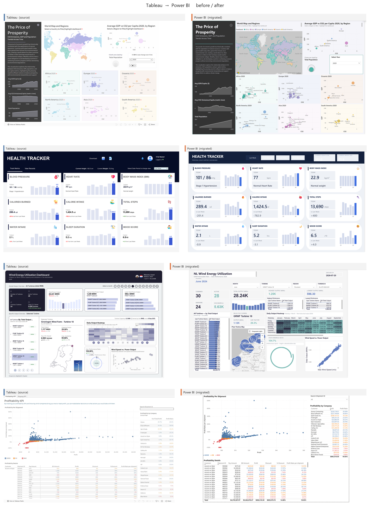
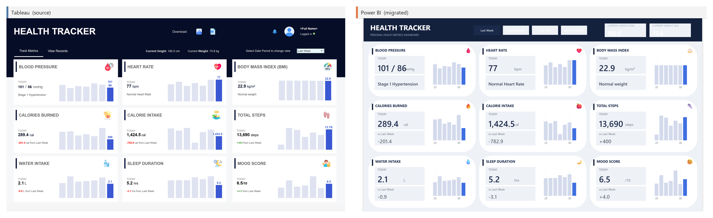
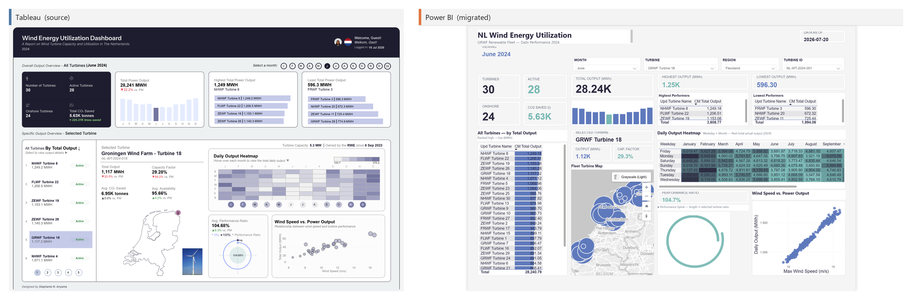
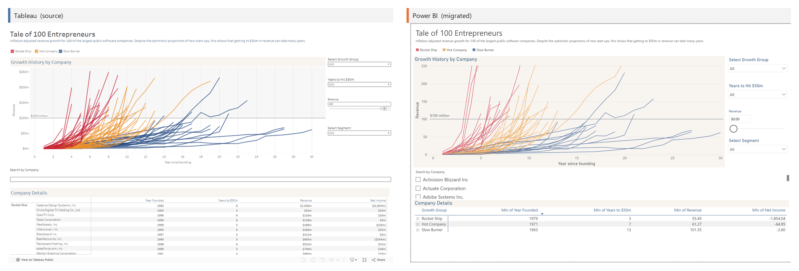
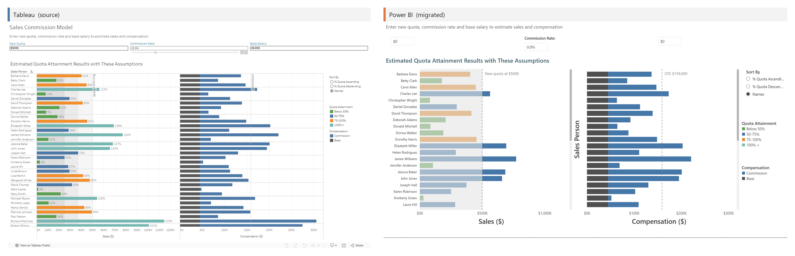
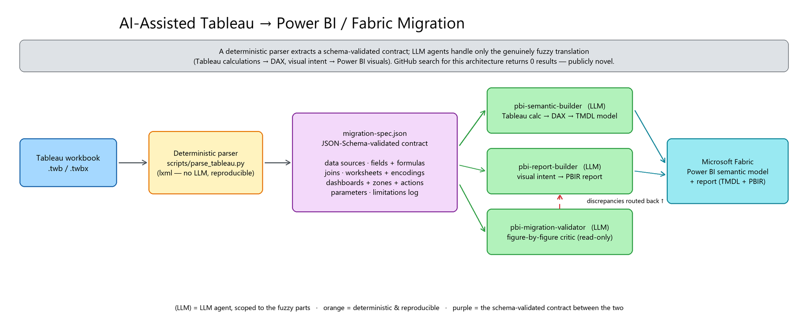

<div align="center">

# Tableau&nbsp;→&nbsp;Power BI / Fabric Migration Toolkit

### AI-assisted migration of Tableau workbooks to Microsoft Fabric Power BI, built as GitHub Copilot CLI agents

[](LICENSE)
&nbsp;
&nbsp;
&nbsp;
&nbsp;
&nbsp;
&nbsp;

**[Showcase](docs/showcase/README.md)** &nbsp;·&nbsp; **[How it works](#how-it-works)** &nbsp;·&nbsp; **[Quickstart](#quickstart)** &nbsp;·&nbsp; **[Capabilities &amp; limits](docs/capabilities-and-limitations.md)**

</div>

<p align="center">
  
</p>

<p align="center">
  <i>Left: the original Tableau Public dashboard. Right: the Power BI report this pipeline generated from it, a live Power BI Desktop render over the migrated semantic model. More pairs are in the <a href="docs/showcase/README.md">showcase</a>.</i>
</p>

---

Point it at a Tableau `.twb` / `.twbx` and it produces a working **Fabric Power BI semantic model + report**. **16 real, publicly available Tableau Public dashboards** have been run through it end to end, spanning KPI dashboards, IronViz infographics, network and origin-destination maps, a what-if calculator, and a 91-worksheet enterprise workbook.

- 🧩 &nbsp;**Deterministic parser, not a black box.** Tableau's `.twb` XML is extracted by code into a schema-validated `migration-spec.json` contract (20/20 `pytest`), so the fuzzy LLM work is scoped to only what needs judgment.
- 🤖 &nbsp;**Four Copilot CLI agents.** An orchestrator coordinates a semantic-model builder, a report builder, and an independent read-only fidelity validator.
- 📊 &nbsp;**DAX + visual translation.** LOD expressions and table calculations become DAX; Tableau worksheets become native Power BI visuals via a 26-entry, render-verified PBIR cookbook.
- 🔍 &nbsp;**Figure-by-figure validation.** The validator compares each built visual against the Tableau original, on both layout and numbers, and routes discrepancies back, catching bugs that would otherwise ship silently.
- ✅ &nbsp;**AI (Copilot) ready.** Every model gets a descriptions + enum-domain pass so it works with Power BI Copilot and natural-language Q&A.
- 📝 &nbsp;**Honest about limits.** Every bug and capability gap found along the way is documented, not hidden (see [capabilities &amp; limitations](docs/capabilities-and-limitations.md)).

This is not a generic "AI can do anything" claim. It is a working pipeline, run end to end against 16
different workbooks, with the bugs found along the way documented honestly.

## 🖼️ Showcase

<table>
  <tr>
    <td width="50%" valign="top"><a href="docs/showcase/README.md"></a><br/><b>Health Tracker</b><br/>Nine KPI cards with 7-day trend bars that highlight the latest day, at exact numeric fidelity.</td>
    <td width="50%" valign="top"><a href="docs/showcase/README.md"></a><br/><b>NL Wind Energy Utilization</b><br/>Star-schema wind fleet; Tableau's polar performance spiral rebuilt as DAX X/Y measures.</td>
  </tr>
  <tr>
    <td width="50%" valign="top"><a href="docs/showcase/README.md"></a><br/><b>Tale of 100 Entrepreneurs</b><br/>LOOKUP first/last and running INDEX table calculations translated to DAX.</td>
    <td width="50%" valign="top"><a href="docs/showcase/README.md"></a><br/><b>Sales Commission Model</b><br/>Three What-If parameters driving a live commission calculator.</td>
  </tr>
</table>

**[See the full migration showcase →](docs/showcase/README.md)** for every before/after pair, each captioned with what translated faithfully and what needed a workaround.

## 🧰 What's in the repo

- **Deterministic Tableau parser + spec schema** (`scripts/parse_tableau.py`): extracts every data
  source, field, calculated-field formula, worksheet encoding, dashboard layout, reference line, and
  theme from the raw `.twb` XML into a normalized, schema-defined `migration-spec.json`
  (see [`docs/migration-spec.md`](docs/migration-spec.md)). Covered by a 20-test `pytest` suite.
- **Four Copilot CLI agents** (`.github/agents/`):
  - `tableau-migrator`: the orchestrator. Runs preflight, then coordinates the three subagents.
  - `pbi-semantic-builder`: translates the spec's calculated fields to DAX and builds the Fabric TMDL
    semantic model (star schema, relationships, measures), using
    [`docs/tableau-dax-translation-guide.md`](docs/tableau-dax-translation-guide.md) as its playbook.
  - `pbi-report-builder`: turns worksheets and dashboards into a PBIR report (pages, visuals,
    bookmarks), chaining the official `powerbi-report-planning`, `powerbi-report-design`, and
    `powerbi-report-authoring` skills.
  - `pbi-migration-validator`: a read-only critic that compares the built report against the Tableau
    original figure by figure, on both visuals and numbers, and reports discrepancies back to the
    orchestrator (it never edits files itself).
- **PBIR visual cookbook** (`.github/pbi.kb/`): a `visual-cookbook.md` plus 26 known-good
  `visuals/*.visual.json` templates harvested from real migrations, so the report builder reuses
  verified PBIR JSON instead of guessing undocumented visual encodings.
- **AI (Copilot) readiness pass** (`scripts/check_ai_readiness.py`): reports the share of tables,
  columns, and measures that carry a TMDL description, and flags categorical columns that do not
  enumerate their domain values, so the generated model is ready for Power BI Copilot and
  natural-language Q&A. It is a required final phase in `pbi-semantic-builder`.
- **Preflight** (`scripts/preflight.ps1`): a dependency-free PowerShell bootstrap the orchestrator
  runs first. It checks Python and parser deps, the `powerbi-authoring` plugin, the MCP servers,
  Power BI Desktop and its Bridge CLI, `npx`, and the TOM DLL, printing an install hint for anything
  missing.

## 🧩 Why a separate parser, not an all-LLM pipeline

Tableau's `.twb` XML (datasources, shelves, zones) is exact and structural, so a deterministic parser
is more reliable and reproducible than LLM reasoning for extraction. LLM reasoning is reserved for the
genuinely fuzzy part: translating Tableau calculation formulas (including LOD expressions and table
calculations) to DAX, and mapping chart intent to the right Power BI visual.

## How it works

```
.twb / .twbx
     │
     ▼
scripts/parse_tableau.py  ──────►  migration-spec.json
(deterministic XML parser)          (data sources, fields, calculated-field
                                     formulas, worksheet encodings, dashboard
                                     layout, theme; see docs/migration-spec.md)
     │
     ├──► pbi-semantic-builder (agent)  ──►  Fabric TMDL semantic model
     │    Translates Tableau formulas to DAX (guide + cookbook),
     │    then runs the AI/Copilot-readiness pass.
     │
     ├──► pbi-report-builder (agent)  ──►  PBIR report (pages/visuals/bookmarks)
     │    Chains powerbi-report-planning, design, authoring,
     │    reusing the .github/pbi.kb visual cookbook.
     │
     └──► pbi-migration-validator (agent)  ──►  figure-by-figure fidelity findings
          Read-only; routes discrepancies back to the orchestrator.
```

The three subagents are orchestrated by `tableau-migrator`, a custom Copilot CLI agent
(`.github/agents/tableau-migrator.agent.md`).



<details>
<summary><strong>⚡ Setup: Copilot plugins &amp; MCP (self-configuring)</strong></summary>

<br>

This toolkit's agents build on Microsoft's official Fabric/Power BI **skill plugin** and talk to Power
BI through **MCP servers**. Those dependencies are declared in the repo so a clone is self-configuring:

- [`AGENTS.md`](AGENTS.md): auto-loaded by Copilot CLI. Declares the required plugin
  (`powerbi-authoring@fabric-collection` from `microsoft/skills-for-fabric`), the MCP servers, and the
  conventions every agent inherits. **Read this first.**
- [`.vscode/mcp.json`](.vscode/mcp.json): MCP server definitions (auto-read by VS Code Copilot; CLI
  users add the same with `/mcp`).
- Repo-local agents (`.github/agents/`) and skills (`.github/skills/`) are committed and load
  automatically.

In Copilot CLI, install the plugin once with `/plugin` (add marketplace `microsoft/skills-for-fabric`,
enable `powerbi-authoring`) and register the MCP servers with `/mcp`. Then run
`powershell -ExecutionPolicy Bypass -File scripts\preflight.ps1` to confirm the machine is configured.

</details>

## Quickstart

```powershell
uv venv
.venv\Scripts\Activate.ps1
uv sync

# Parse a workbook into the intermediate spec
python scripts\parse_tableau.py migrations\<name>\source\<workbook>.twbx `
    -o migrations\<name>\migration-spec.json

# If the workbook uses .hyper extracts (no live DB), pull the real row data too:
python scripts\extract_hyper_data.py migrations\<name>\source\<workbook>.twbx `
    -o migrations\<name>\data
```

Then, in [GitHub Copilot CLI](https://github.com/github/copilot-cli), run the orchestrator agent:

```
/agent tableau-migrator
```

and point it at `migrations\<name>\migration-spec.json`.

## 🧪 Try a worked example

Every folder under `migrations/<name>/` is a complete run: the parsed `migration-spec.json` plus the
generated `fabric/<Name>.SemanticModel` and `fabric/<Name>.Report` PBIP project, ready to open in Power
BI Desktop. A good first read is `migrations/eea-urban-adaptation/`, a run against the European
Environment Agency's public
["Urban Audit city factsheets, Urban Adaptation Map Viewer"](https://public.tableau.com/app/profile/european.environment.agency/viz/test_20190116Urban_vulnerability_ideasFR_0/mainpage)
workbook (16 worksheets, 7 data sources, 152 fields).

**After cloning**, before you can refresh a model with live data, you must:

1. Download the workbook yourself from its Tableau Public link (source `.twbx` and extracted data are
   gitignored, not redistributed here) and re-run the two scripts above, **or** just open the report to
   inspect the already-built semantic model/report structure without live data.
2. Point the `DataFolder` Power Query parameter (Transform data → Manage Parameters) at your local
   `migrations/<name>/data/` path. It ships with a placeholder because M parameters cannot be relative
   to the project file. The helper `scripts\set_data_folder.py` can set this for you.

<details>
<summary><strong>📁 Repo layout</strong></summary>

<br>

```
.github/agents/          Four custom Copilot CLI agents (orchestrator + 3 subagents)
.github/pbi.kb/          PBIR visual cookbook (visual-cookbook.md + 26 visual.json templates)
scripts/                 Python automation (parser, .hyper extractor, AI-readiness, showcase) + preflight.ps1
docs/                    migration-spec schema, Tableau->DAX guide, capabilities & limitations, showcase
migrations/<name>/       Per-workbook working folder: source (gitignored), spec, Fabric output, reference PNGs
tests/                   pytest suite + XML fixtures for the parser
```

</details>

## 🛠️ Development

```powershell
uv sync --extra dev
ruff format . ; ruff check . --fix
pylint scripts
pytest -q            # 20 parser tests
```

## 📊 Status: what's covered

**Working end to end across 16 real Tableau Public workbooks.** Every folder under `migrations/`
carries a generated `.SemanticModel` and `.Report`. Highlights of the range covered:

- **`airline-alliance-activity`**: the largest, at 91 worksheets across a 4-page CY/PY navigation app.
  Surfaced (and fixed) a systematic DAX bug where 58 comparison measures used the illegal compact
  filter `'Table'[Col]=[Measure]`, hoisted to VARs.
- **`eea-urban-adaptation`**: 16 worksheets, 7 data sources, 152 fields; validated figure by figure
  against the source with live DAX queries (see the capabilities writeup).
- **`shipping-kpis`** and **`health-tracker`**: exercise **FIXED LOD** expressions translated to DAX.
- **`tale-of-100-entrepreneurs`** and **`quadruple-axis-charts`**: exercise **table calculations**
  (LOOKUP first/last, running INDEX, WINDOW/RANK) translated to verified DAX.
- **`sales-commission-model`**: three What-If parameters driving a live commission calculator.

What is genuinely hard and the pipeline handled: dense IronViz-style infographics and custom-geometry
charts. `broadway-stage-to-screen` (an IronViz infographic), `spiraling-satellites` (custom spiral
geometry), `fast-fashion-impact` (34 worksheets, 11 data sources), and `wind-energy-utilization`
(35 worksheets) all parse and build. Their Power BI Desktop render capture is still pending, so they
are marked as built-but-not-yet-render-verified in the showcase.

Render-verified pairs (committed before/after screenshots) currently cover `price-of-prosperity`,
`airline-alliance-activity`, `shipping-kpis`, `tale-of-100-entrepreneurs`, and `sales-commission-model`.
LOD expressions and table calculations, previously only documented, are now exercised by real
workbooks; the patterns live in `docs/tableau-dax-translation-guide.md`.

### 🗺️ Roadmap

- **In progress:** re-rendering the origin-destination line map (`telecommunications-analytics`,
  `superstore-sales-performance`) and the Azure Maps choropleths, whose Desktop renders are being
  redone before they are featured as verified.
- **Not built yet:** a `pbi-deployer` agent to publish to a Fabric workspace, refresh, and run a
  screenshot-based fidelity check as an automated closing step.

Contributions, especially additional worked examples against different Tableau workbooks, are welcome.

## 📄 License

[MIT](LICENSE).
