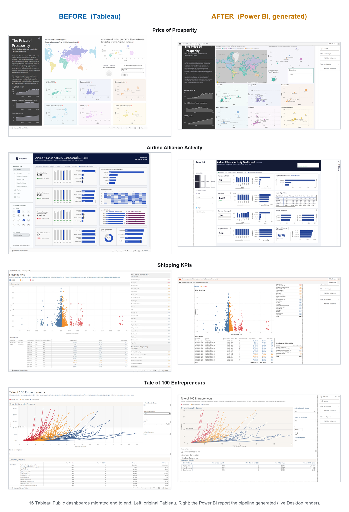
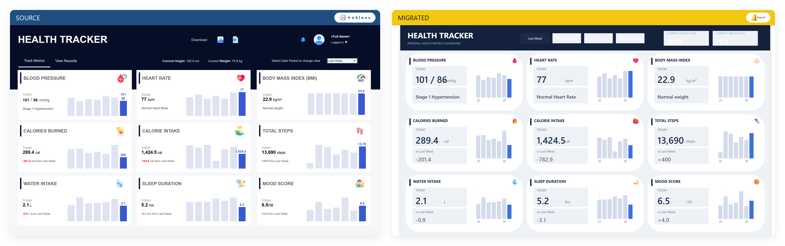
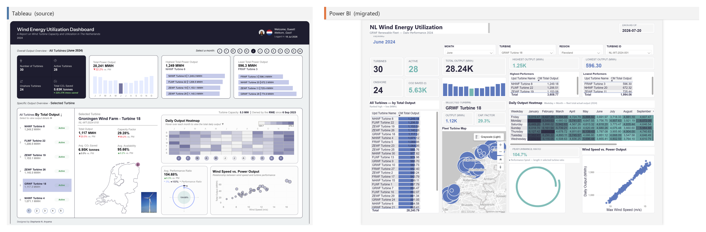
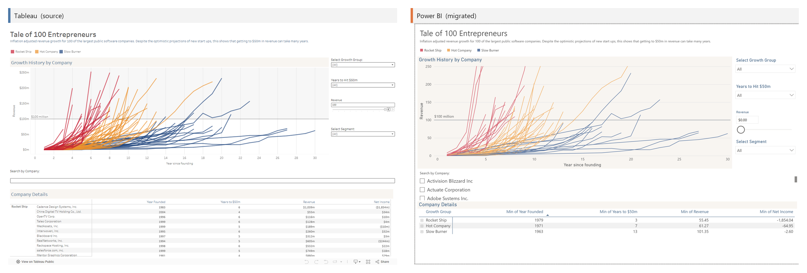
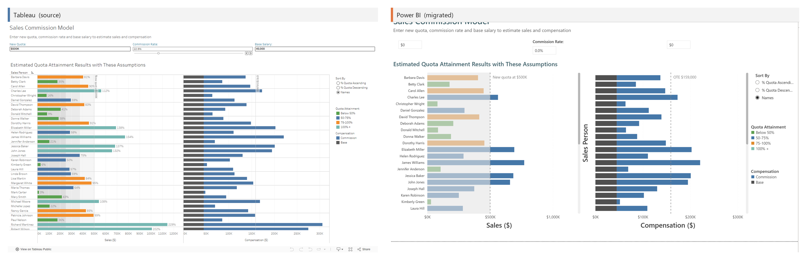
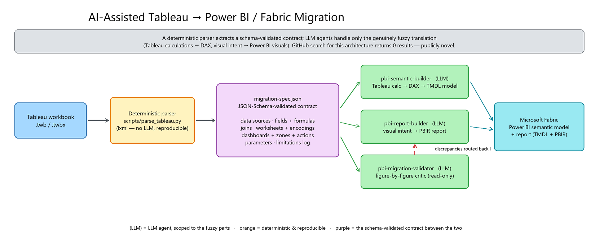

<div align="center">

# Tableau&nbsp;→&nbsp;Power BI / Fabric Migration Toolkit

### AI-assisted migration of Tableau workbooks to Microsoft Fabric Power BI, built as GitHub Copilot CLI agents

> **Unofficial project disclaimer.** This repository is an unofficial personal/community project. It is not an official Microsoft, Microsoft Fabric, Power BI, GitHub, GitHub Copilot, or Tableau product, and it is not sponsored, endorsed, or maintained by those organizations. Contributor activity here is in a personal capacity and does not imply employer representation or endorsement.

[](LICENSE)
&nbsp;
&nbsp;
&nbsp;
&nbsp;
&nbsp;
&nbsp;

**[TL;DR](#tldr)** &nbsp;·&nbsp; **[Quickstart](#quickstart)** &nbsp;·&nbsp; **[What you get](#what-you-get)** &nbsp;·&nbsp; **[Repo layout](#repo-layout)** &nbsp;·&nbsp; **[Three phases](#the-three-phase-pipeline)** &nbsp;·&nbsp; **[How it works](#how-it-works)** &nbsp;·&nbsp; **[Prerequisites](#prerequisites)** &nbsp;·&nbsp; **[Capabilities &amp; limits](docs/capabilities-and-limitations.md)**

</div>

<p align="center">
  
</p>

<p align="center">
  <i>Left: the original Tableau Public dashboard. Right: the Power BI report this pipeline generated from it, a live Power BI Desktop render over the migrated semantic model. More pairs are in the <a href="docs/showcase/README.md">showcase</a>.</i>
</p>

---

## TL;DR

This toolkit turns a Tableau `.twb` or `.twbx` into a local **Fabric Power BI semantic model + report**. It combines a deterministic parser with Copilot CLI agents that translate DAX and visuals, then independently validate fidelity. You get a reviewable PBIP project, worked public examples, and an honest record of supported features and limits.

## Quickstart

> **Have one local `.twb` or `.twbx`, hand-supplied Tableau screenshots, and no Tableau
> Server/Cloud connection?** Follow the **[single-workbook guide](docs/start-with-one-workbook.md)**.

**Clone.** The 16 worked examples under `examples/` are ~91% of the repo's files. If you're mainly
here for the **agent logic** (agents, scripts, docs), do a *blobless sparse* clone — it never downloads
the example blobs:

```bash
git clone --filter=blob:none --sparse https://github.com/Guust-Franssens/tableau-to-powerbi-migration.git
cd tableau-to-powerbi-migration
git sparse-checkout set .github .vscode docs scripts tests migrations
# want one example to look at? pull just that folder:
git sparse-checkout add examples/eea-urban-adaptation
```

For the full repo (all examples + showcase), use a normal `git clone …`. Then set up the Python env:

```powershell
uv venv
.venv\Scripts\Activate.ps1
uv sync --all-extras   # --all-extras pulls tableauhyperapi/playwright/pillow used by the scripts below

powershell -ExecutionPolicy Bypass -File scripts\preflight.ps1

# Parse a workbook into the intermediate spec
python scripts\parse_tableau.py migrations\workbooks\<name>\source\<workbook>.twbx `
    -o migrations\workbooks\<name>\migration-spec.json

# If the workbook uses .hyper extracts (no live DB), pull the real row data too:
python scripts\extract_hyper_data.py migrations\workbooks\<name>\source\<workbook>.twbx `
    migrations\workbooks\<name>\migration-spec.json `
    -o migrations\workbooks\<name>\data
```

Then, in [GitHub Copilot CLI](https://github.com/github/copilot-cli), run the orchestrator agent:

```
/agent tableau-migrator
```

and point it at `migrations\workbooks\<name>\migration-spec.json`.

> **Migrating a whole Tableau *site*, not one workbook?** That is a different, mostly deterministic
> pipeline — survey → assess → harvest → convert → deploy — and it has its own step-by-step
> procedure with measured timings, exit codes, decision points and a failure playbook:
> **[`docs/operator-runbook.md`](docs/operator-runbook.md)**. Read it before the day you need it.

## What you get

<table>
  <tr>
    <td width="50%" valign="top"><a href="docs/showcase/README.md"></a><br/><b>Health Tracker</b><br/>Nine KPI cards with 7-day trend bars that highlight the latest day, at exact numeric fidelity.</td>
    <td width="50%" valign="top"><a href="docs/showcase/README.md"></a><br/><b>NL Wind Energy Utilization</b><br/>Star-schema wind fleet; Tableau's polar performance spiral rebuilt as DAX X/Y measures.</td>
  </tr>
  <tr>
    <td width="50%" valign="top"><a href="docs/showcase/README.md"></a><br/><b>Tale of 100 Entrepreneurs</b><br/>LOOKUP first/last and running INDEX table calculations translated to DAX.</td>
    <td width="50%" valign="top"><a href="docs/showcase/README.md"></a><br/><b>Sales Commission Model</b><br/>Three What-If parameters driving a live commission calculator.</td>
  </tr>
</table>

**[See the full migration showcase →](docs/showcase/README.md)** for every before/after pair, each captioned with what translated faithfully and what needed a workaround.


### Try a worked example

Every folder under `examples/<name>/` is a complete run: the parsed `migration-spec.json` plus the
generated `fabric/<Name>.SemanticModel` and `fabric/<Name>.Report` PBIP project, ready to open in Power
BI Desktop. A good first read is `examples/eea-urban-adaptation/`, a run against the European
Environment Agency's public
["Urban Audit city factsheets, Urban Adaptation Map Viewer"](https://public.tableau.com/app/profile/european.environment.agency/viz/test_20190116Urban_vulnerability_ideasFR_0/mainpage)
workbook (16 worksheets, 7 data sources, 152 fields).

**After cloning**, before you can refresh a model with live data, you must:

1. Download the workbook yourself from its Tableau Public link (source `.twbx` and extracted data are
   gitignored, not redistributed here) and re-run the two scripts above, **or** just open the report to
   inspect the already-built semantic model/report structure without live data.
2. Point the `DataFolder` Power Query parameter (Transform data → Manage Parameters) at your local
   `examples/<name>/data/` path. It ships with a placeholder because M parameters cannot be relative
   to the project file. The helper `scripts\set_data_folder.py` can set this for you.

### Sources & attribution

Every example is a **public Tableau Public workbook built by its original author**. This repo does **not**
redistribute the source `.twb` / `.twbx` files or their extracted data (they are gitignored): to reproduce
a migration, download the workbook from its Tableau Public link and re-run `scripts/parse_tableau.py`. What
*is* committed is the generated Power BI output plus reference **screenshots** of the original dashboard,
which are what the before/after showcase is built from.

The Tableau Public source URL for all 16 workbooks is listed in
**[`examples/README.md`](examples/README.md)**, and every
[showcase](docs/showcase/README.md) entry links back to the dashboard it was migrated from. Credit for the
original dashboards belongs to their respective Tableau Public authors.

### Toolkit components

- **Deterministic Tableau parser + spec schema** (`scripts/parse_tableau.py`): extracts every data
  source, field, calculated-field formula, worksheet encoding, dashboard layout, reference line, and
  theme from the raw `.twb` XML into a normalized, schema-defined `migration-spec.json`
  (see [`docs/migration-spec.md`](docs/migration-spec.md)). Also accepts a standalone `.tds`/`.tdsx`
  data source, and flags Tableau **published** data sources (`sqlproxy`) with a stable dedup key so one
  shared datasource becomes **one** semantic model instead of a duplicate per workbook
  (`scripts/published_datasource_registry.py`). Covered by a 48-test `pytest` suite.
- **Estate lineage discovery** (`scripts/tableau_lineage.py`): for a whole Tableau Server/Cloud estate,
  queries the **Metadata API** (`publishedDatasources { downstreamWorkbooks }`) and prints a
  **model-first migration plan** ordered by leverage — migrate each published data source once, then
  bind every downstream workbook's report to it — and can `--download` each `.tdsx` for parsing.
- **Four Copilot CLI agents** (`.github/agents/`):
  - `tableau-migrator`: the orchestrator. Runs preflight, then coordinates the three subagents.
  - `pbi-semantic-builder`: translates the spec's calculated fields to DAX and builds the Fabric TMDL
    semantic model (star schema, relationships, measures), using
    [`docs/tableau-dax-translation-guide.md`](docs/tableau-dax-translation-guide.md) as its playbook.
  - `pbi-report-builder`: turns worksheets and dashboards into a PBIR report (pages, visuals,
    bookmarks), chaining the official `powerbi-report-planning`, `powerbi-report-design`, and
    `powerbi-report-authoring` skills.
  - `pbi-migration-validator`: a read-only critic that compares the built report against the Tableau
    original figure by figure, on both visuals and numbers, and reports discrepancies back to the
    orchestrator (it never edits files itself).
- **PBIR visual cookbook** (`.github/pbi.kb/`): a `visual-cookbook.md` plus 27 known-good
  `visuals/*.visual.json` templates harvested from real migrations, so the report builder reuses
  verified PBIR JSON instead of guessing undocumented visual encodings.
- **AI (Copilot) readiness pass** — the [`powerbi-ai-readiness`](.github/skills/powerbi-ai-readiness/SKILL.md)
  skill. `check_ai_readiness.py` reports the share of tables, columns, and measures that carry a TMDL
  description and flags categorical columns that do not enumerate their domain values;
  `set_ai_instructions.py` stamps the model's AI instructions into its culture TMDL, forces
  `qnaEnabled: true` (false silently voids everything else), and gates one model with
  `--check --strict --model`. It is a required final phase in `pbi-semantic-builder`.
- **Preflight** (`scripts/preflight.ps1`): a dependency-free PowerShell bootstrap the orchestrator
  runs first. It checks Python and parser deps, the `powerbi-authoring` plugin, the MCP servers,
  Power BI Desktop and its Bridge CLI, `npx`, the .NET SDK, and the known-good CLI version matrix
  (plus `powerbi-report-author doctor`), printing an install hint for anything missing.
- **Operator runbook** ([`docs/operator-runbook.md`](docs/operator-runbook.md)): the
  command-by-command procedure for running a real estate migration — day-before pre-flight, the
  happy path with measured timings, the decision points where you stop and ask, a symptom → cause →
  fix failure playbook, a verification checklist, and an explicit list of what that checklist does
  **not** prove. Start here if you are the one at the keyboard.


## Repo layout

| Path | What it is |
| --- | --- |
| [`examples/`](examples/) | 16 committed, worked migrations. Read-only reference — **not** where your work goes. |
| [`migrations/{workbooks,datasources}/<slug>/fabric/`](migrations/README.md) | **Where your deliverables land**: workbook reports and shared datasource semantic models. |
| [`scripts/`](scripts/) | The CLI surface; [`scripts/README.md`](scripts/README.md) is the map. |
| [`docs/`](docs/) | Start with [`INDEX.md`](docs/INDEX.md), the map of maps. |
| [`.github/{agents,skills}/`](.github/) | The Copilot agent personas and reusable knowledge bundles. |
| `_runs/<NNN>-<slug>/` | Per-run working state — the first two phases below. Gitignored by construction (`/_*`), but **not disposable**: only its `scratch/` subdir is, and a whole run becomes safe to delete only after its units are promoted and verified. |

## The three-phase pipeline

A migration moves through **three locations, one direction**. Knowing which is which is most of
knowing where to find something. Full explanation, with the measured figures and the gates:
**[`docs/migration-phases.md`](docs/migration-phases.md)**.

```text
_runs/<NNN>-<slug>/                     ◀── PHASE 1  collect & convert  (gitignored)
├── run.json                                what ran, against which site, at which SHAs
├── assessment/                             what exists, what is USED, migration order
│   ├── estate_survey.json                    the live-site survey the engine emits
│   ├── assessment.json  report.md            the decision, and its human-readable form
│   └── estate.db
├── assets/
│   ├── assets/                             the downloads: .twb(x) workbooks, .tds(x) sources
│   └── parse-sweep.json  parse-sweep.md      both parsers' failure distribution over them
├── oracle/                                 Tableau's OWN renders and numbers
│   ├── images/  data/                        ⚠️ only for views that captured — 288 of 360 here
│   └── oracle-manifest.json                  every view: captured, or not — with status and reason
├── bundle/                                 the deterministic engine's conversion output
│   ├── reports/<WB>.Report/                  ⚠️ engine truth — NEVER edit
│   ├── semantic_models/<Model>.SemanticModel/ ⚠️ engine truth — NEVER edit; 18 for 62 pbip/ units
│   ├── pbip/<Unit>/                          the working copy: .Report + .SemanticModel + .pbip
│   ├── handover/<WB>.json                    the per-workbook remediation queue
│   ├── data/                                 materialised extract rows
│   └── engine-output-receipt.json            which engine version built this, and from where
│
├── packages/<batch>/<Unit>/            ◀── PHASE 2  one self-contained folder per unit
│   ├── README.md  handover.md              start here — the gate commands, pre-scoped
│   ├── migration-spec.json                 the parsed source                    (64 of 67)
│   ├── fabric/                             the packaged copy of bundle/pbip/    (62 of 67)
│   │   ├── <WB>.Report/                      PBIR
│   │   ├── <Model>.SemanticModel/            TMDL
│   │   └── <WB>.pbip
│   ├── assets/<luid>_<Unit>.<ext>          the original source, alongside          (65 of 67)
│   ├── handover/<WB>.json                  this unit's slice of the queue       (46 of 67)
│   ├── oracle/                             this unit's reference evidence       (46 of 67)
│   │   ├── worksheet/{images,data}/
│   │   ├── dashboard/{images,data}/          (an `unknown/` tier appears if a view's type is unset)
│   │   └── oracle-manifest.json
│   ├── report.json  source-provenance.json   gate input, and source-to-LUID attribution
│   ├── engine-output-receipt.json            which engine version built this      (67 of 67)
│   └── package-manifest.json               what was packaged, and every omission with its reason
│
├── deliverables/                           customer-facing outputs — never committed
└── scratch/                                the ONLY subdir that is safe to delete

migrations/workbooks/<slug>/fabric/      ◀── PHASE 3  ship  (the deliverable only — the unit
├── <WB>.Report/                                root may also hold source/, data/,
├── <Model>.SemanticModel/                      reference/ and migration-spec.json)
└── <WB>.pbip                               ← what the customer opens in Power BI Desktop
```

⚠️ **Every counted entry above is conditional — and the rule is NOT the source type.** On the
67-package reference run, **5 units had no engine working copy** (`Meridian_Calc_Gauntlet`,
`Meridian_Collision_Alpha`, `Meridian_Trip_Economics`, `RESTAPISample`, `TS_Users`) — four of them
*workbooks*, so this is a per-unit conversion gap, not "datasources lack a report". 18 of the 19
`.tds` units **do** ship a report, model and PBIP. Handover and oracle evidence exist for 46 of 67.
The tree shows selected entries, not an exhaustive listing.

⚠️ **Phase 3 is *trackable*, not automatically committed** — `data/` and customer-prefixed units are
gitignored, so commit only what is public-safe.

⚠️ **Which copy to edit is currently unsettled** ([#460](https://github.com/Guust-Franssens/tableau-to-powerbi-migration/issues/460)):
`AGENTS.md` says `bundle/pbip/`, the generated package README says `<package>/fabric/`, and the
package is a physical copy, so the two diverge the moment either is edited. Promote from whichever
one carries the edits, and verify before and after.

A **shared** datasource ships once to `migrations/datasources/<ds-slug>/fabric/` instead, and every
report that uses it keeps a rewritten `definition.pbir` pointing four levels up at it.

**1. Collect & convert** → `_runs/<NNN>-<slug>/`

Run `run_engine_survey.py` → `assess_estate.py` → `harvest_estate_assets.py` → `run_estate.py`, plus
`capture_tableau_oracle.py`. You get four subdirectories: `assessment/` (what exists, what is used,
migration order), `assets/` (the downloads), `bundle/` (the engine's conversion output) and
`oracle/` (Tableau's own renders and numbers).

**2. Package for the agent** → `_runs/<NNN>-<slug>/packages/<batch>/<Unit>/`

[`scripts/package_unit.py`](scripts/package_unit.py) emits one self-contained folder per migration
unit — source, engine output, handover queue and reference evidence together — which **both gates
accept with no flags**.

**3. Ship** → `migrations/{workbooks,datasources}/<slug>/fabric/`

The PBIP project a customer opens in Power BI Desktop.
⚠️ Still a manual copy — no tool yet (issue
[#458](https://github.com/Guust-Franssens/tableau-to-powerbi-migration/issues/458)).

Two gates sit on phase 2: `check_reference_readiness.py` is the **entry** gate (per report page, is
there trustworthy Tableau reference evidence to start from?) and `check_unit.py` is the **exit** gate
(is this unit done?). ⚠️ A page the entry gate calls **`blind` is a finding, not a pass** — it means a
fidelity bug on that page would be structurally unfalsifiable, so it exits non-zero and you deal with
it before building.

⚠️ **Both gates check the phase-2 package, not the phase-3 deliverable.** `check_unit.py` will run
against a shipped `migrations/` folder, but it checks **less** there: measured on
`examples/shipping-kpis`, page parity still passes while oracle coverage and the engine receipt both
degrade to `NOT_CHECKED`, because the oracle and `engine-output-receipt.json` live in the package and
are not shipped. That is honest rather than a false pass — `NOT_CHECKED` exits non-zero — but it is
why a unit is verified **before** it is promoted, not after.

Three things about that flow are worth knowing before you touch it, and each has cost someone real
work:

- Inside `bundle/`, **`reports/` is the pristine engine-truth baseline and `pbip/` is a working
  copy** agents edit. There is no `out/` level. (It is not the only one — see the third bullet.)
- **`bundle/semantic_models/` is not a per-workbook guarantee** — on our 62-unit reference run only
  **18** units had a model baseline. A missing counterpart is **BASELINE UNAVAILABLE**, never a
  clean diff.
- **Phase 2 → 3 is a high-risk hop**, for two evidenced reasons. The copy is where
  `definition.pbir`'s `byPath` stops resolving, and a wrong one opens as *a report with no model*
  while `powerbi-report-author validate` still returns `errorCount: 0` — it checks reference shape,
  not target. And you must copy FROM the right tree: the phase-2 package's `fabric/` is a physical
  copy of `bundle/pbip/`, and the two diverge as soon as an agent edits either. **When a package
  exists, its `fabric/` is CANONICAL and you promote from there**
  ([#460](https://github.com/Guust-Franssens/tableau-to-powerbi-migration/issues/460)) — it is the
  tree the package's own README tells an agent to edit, it is what `AGENTS.md`'s working-copy row
  names, and re-running `package_unit.py` over an edited package now refuses (exit 3) rather than
  quietly replacing it — `--discard-package-edits` is the deliberate override, and a package with no
  recorded digest refuses too, because "I cannot tell whether this was edited" is not "it was not
  edited". A *stale* artifact is a different thing and is still removed silently: the previous run
  recorded it, the new input no longer produces it, so it never looks like an edit.
  Promote from `bundle/pbip/` only for a unit that was never packaged.

Running the pipeline yourself? The command-by-command procedure, with timings, exit codes and a
failure playbook, is **[`docs/operator-runbook.md`](docs/operator-runbook.md)**.

## How it works

```
.twb / .twbx
     │
     ▼
scripts/parse_tableau.py  ──────►  migration-spec.json
(deterministic XML parser)          (data sources, fields, calculated-field
                                     formulas, worksheet encodings, dashboard
                                     layout, theme; see docs/migration-spec.md)
     │
     ├──► pbi-semantic-builder (agent)  ──►  Fabric TMDL semantic model
     │    Translates Tableau formulas to DAX (guide + cookbook),
     │    then runs the AI/Copilot-readiness pass.
     │
     ├──► pbi-report-builder (agent)  ──►  PBIR report (pages/visuals/bookmarks)
     │    Chains powerbi-report-planning, design, authoring,
     │    reusing the .github/pbi.kb visual cookbook.
     │
     └──► pbi-migration-validator (agent)  ──►  figure-by-figure fidelity findings
          Read-only; routes discrepancies back to the orchestrator.
```

The three subagents are orchestrated by `tableau-migrator`, a custom Copilot CLI agent
(`.github/agents/tableau-migrator.agent.md`).



## 🧩 Why a separate parser, not an all-LLM pipeline

Tableau's `.twb` XML (datasources, shelves, zones) is exact and structural, so a deterministic parser
is more reliable and reproducible than LLM reasoning for extraction. LLM reasoning is reserved for the
genuinely fuzzy part: translating Tableau calculation formulas (including LOD expressions and table
calculations) to DAX, and mapping chart intent to the right Power BI visual.

<a id="prerequisites"></a>

## ⚙️ Prerequisites

You can browse the showcase and read the examples without any local setup. Before you run a migration,
install or confirm the runner pieces below:

- **Git + GitHub Copilot CLI** for the agent personas.
- **Python 3.11+ and `uv`** for the parser, harvesters, validators and tests.
- **Node.js 20+** for the Power BI report-authoring and Desktop bridge CLIs.
- **Power BI Desktop** for opening, refreshing and rendering the local PBIP output.
- **Copilot plugins/MCP servers** below, including the separate deterministic conversion engine plugin
  (`tableau-fabric-skills@tableau-collection`).

The Quickstart below stops at a **local PBIP** (`migrations\workbooks\<name>\fabric\...`). For a
customer/estate run, treat publish-to-Fabric as an operator step documented in the runbook, not as a
finished one-command agent handoff yet.

<details>
<summary><strong>⚡ Copilot plugins, conversion engine &amp; MCP (self-configuring)</strong></summary>

<br>

This toolkit has two tiers. The **deterministic Tableau → PBIP conversion engine is not in this
repo**; it is installed as the `tableau-fabric-skills@tableau-collection` Copilot plugin. This repo
contains the parser, wrappers, examples, docs, and four Copilot agent personas that critique, enrich
and fix the engine's output. The agents also build on Microsoft's official Fabric/Power BI skill
plugin and talk to Power BI through **MCP servers**. Those dependencies are declared in the repo so a
clone is self-configuring:

- [`AGENTS.md`](AGENTS.md): auto-loaded by Copilot CLI. Declares the required plugins
  (`powerbi-authoring@fabric-collection` from `microsoft/skills-for-fabric`, plus this repo's own
  `powerbi-playbook@powerbi-playbook-collection`), the MCP servers, and the conventions every
  agent inherits. **Read this first.**
- [`.vscode/mcp.json`](.vscode/mcp.json): MCP server definitions (auto-read by VS Code Copilot; CLI
  users add the same with `/mcp`).
- Repo-local agents (`.github/agents/`) are committed and load automatically. So are repo-local
  skills under `.github/skills/` (an enabled skill location — see `.vscode/settings.json`), which
  currently ships four:
  [`pbip-model-refresh`](.github/skills/pbip-model-refresh/SKILL.md) (refresh a local PBIP model in
  Power BI Desktop and persist it to `cache.abf`),
  [`powerbi-ai-readiness`](.github/skills/powerbi-ai-readiness/SKILL.md) (descriptions, enumerated
  domains, `CustomInstructions`, `qnaEnabled`, and how to write AI instructions that help rather than
  mislead),
  [`powerbi-report-gotchas`](.github/skills/powerbi-report-gotchas/SKILL.md) (PBIR encodings and
  Desktop-verification failures that pass `validate` but render wrong) and
  [`powerbi-semantic-model-gotchas`](.github/skills/powerbi-semantic-model-gotchas/SKILL.md) (TMDL/DAX
  defects that deserialize cleanly but break at open, refresh or render). Each is a **self-contained
  bundle** — `SKILL.md` plus, where it ships code, its own `scripts/` and `tests/` — so copying one
  folder into a Qlik or Cognos migration repo takes the whole procedure with it; a test proves that by
  running the copy's tests outside this repo. All four are also published as a plugin so *other* repos
  can install rather than copy. Drop new skills in the same place.
- **Measured 2026-07-31:** a custom subagent can invoke these **by name** — repo-local ones included —
  unless its persona declares a `tools:` allow-list that omits `skill`. See
  [`docs/agent-architecture.md`](docs/agent-architecture.md) §6.
- **A live source must be PROVEN reachable before a model is built — enforced, not requested.** When a
  workbook connects to a live database (Databricks, Snowflake, SQL Server…), the pipeline applies a
  **kernel-level write-deny** to that migration's output folder until a real one-row query, run
  *through Power BI Desktop*, returns data. So a semantic model for a source nothing ever contacted
  physically cannot be written. It exists because asking did not work: measured across four blind
  migrations, every agent announced the stop correctly and three then built anyway. The gate is about
  **reachability, not credentials** — only the probe can tell a missing sign-in (a human must act)
  from a wrong hostname (nobody needs to sign in). See
  [`docs/credential-gate.md`](docs/credential-gate.md) — including an honest threat model, since this
  stops the *accidental* case outright but only *detects* deliberate circumvention.

In Copilot CLI, install the plugins once with `/plugin` (including
`tableau-fabric-skills@tableau-collection`, plus the `microsoft/skills-for-fabric` and
`Guust-Franssens/powerbi-playbook` skill plugins) and register the MCP servers with `/mcp`. Then run
`powershell -ExecutionPolicy Bypass -File scripts\preflight.ps1` to confirm the machine is configured.
Preflight reports a concrete install hint for anything missing and blocks if the conversion engine is
installed from more than one source; the plugin is the canonical engine.

</details>

### Power BI Desktop settings for unattended runs

Set these after Desktop is installed and before the first agent/refresh run. They are intentionally
here rather than at the top of Quickstart: they matter only once you are about to open models in
Desktop, and front-loading them before clone/env setup makes the first-run path look more dangerous
than it is.

> ### ⚠️ One-time Power BI Desktop setting: turn OFF Privacy Levels
>
> **Options → Global → Privacy → "Always ignore Privacy Level settings"**
>
> Without it, opening any model that spans **more than one data source** raises a modal —
> *"Potential security risk: This file uses multiple data sources…"* — **before the model loads**.
> Federated datasources are normal in real Tableau workbooks, so most migrations hit this.
>
> It matters more for agents than for people. The dialog blocks at **load time**, so it stalls
> before any refresh call and no automation can dismiss it: measured 2026-08-05, a run sat past
> **450 s** on it while the refresh script's own 300 s ceiling never fired, because that ceiling
> wraps the XMLA refresh rather than the open. To a supervising agent it looks like a hang with no
> error, which is the single failure mode this toolkit's conventions exist to prevent.
>
> Setting it once is safe here: the reachability probe builds a throwaway **one-row** copy of the
> model, so there is no real data-privacy boundary to protect. `scripts/preflight.ps1` cannot read
> this setting — Desktop ships as an MSIX package and stores it outside the registry — so it stays a
> documented manual step rather than an automated check.

> ### ⚠️ Second one-time setting, if you migrate custom SQL: allow native database queries
>
> **Options → Global → Security → uncheck "Require user approval for new native database queries"**
>
> A Tableau **custom SQL** relation has no table to navigate to, so it migrates to a
> `Value.NativeQuery(...)` partition. Desktop gates those behind *"Permission is required to run this
> native database query"* — a modal, so it stalls a headless refresh exactly like the Privacy dialog
> above. One estate hit ~35 such partitions across 72% of its assets, which is 35 potential stalls
> rather than one.
>
> Four things decide whether this affects you
> ([Microsoft Learn](https://learn.microsoft.com/en-us/power-query/native-database-query)):
>
> - **It is a Desktop-only prompt.** The Service, a gateway refresh and XMLA refresh never show it. If
>   a model's refresh path ends in the Service, you can ignore this entirely.
> - **Approval is keyed to the exact query TEXT**, not the data source or the file — so regenerating a
>   model with changed SQL re-arms the prompt, even for whitespace.
> - **Approval does not travel with the artifact.** It is user- and machine-scoped, so a fresh build
>   agent, and every analyst you hand a deliverable to, starts unapproved.
> - **You cannot dodge it in M.** `[EnableFolding=true]` does not suppress it (Microsoft's own folding
>   doc shows the prompt appearing *with* that option set), no `Value.NativeQuery` option suppresses
>   it, and `Sql.Database(…, [Query=…])` prompts identically.
>
> ⚠️ **Set it in the UI, not the registry.** The widely-repeated `DisableNativeDbQueryPrompt` registry
> value is community folklore rather than documented, and on an **MSIX/Store** Desktop it does nothing
> at all: measured 2026-08-19 on 2.157.828.0, all three candidate keys are absent because MSIX
> virtualises registry writes into `%LOCALAPPDATA%\Packages\Microsoft.MicrosoftPowerBIDesktop_*\Settings\`
> — the same reason preflight cannot read the Privacy setting above.
>
> Unlike Privacy Levels, this one is a genuine security feature: it exists so a native query written by
> someone else cannot run under **your** database credentials. Turning it off is reasonable on a build
> agent whose credentials are read-only service accounts; think harder before doing it on an analyst's
> laptop.

## 🛠️ Development

This is a fast local subset of CI — not the whole workflow. CI additionally runs the migration-spec,
privacy, data-model, navigation, capability-wiring, convention-sync and AI-readiness gates plus a
Windows bundle job; see [`.github/workflows/checks.yml`](.github/workflows/checks.yml) for the full set.

Every command goes through `uv run`, exactly as CI does. That is not a stylistic choice: `uv sync`
populates `.venv` but does not activate it, so in a fresh shell a bare `pytest` is simply not found,
and a bare `ruff`/`pylint` silently resolves to whatever is installed globally. Measured on this
repository, on identical code:

| command | exit | score | findings |
|---|---|---|---|
| `pylint scripts` (global) | **10** | 9.97 | **10** |
| `uv run pylint scripts` | **0** | 10.00 | 0 |

The global install cannot see the project's optional dependencies, so it invents import errors CI
never reports. Chasing those is pure waste, and the real signal is buried among them.

The paths are CI's paths, deliberately. Repo-wide `ruff format .` is safe because
`pyproject.toml` excludes the two documentation trees where the drift was measured (`docs/`,
`.github/pbi.kb/`) and uses `force-exclude = true` so explicitly named files in those trees are
excluded too. Other Markdown outside CI's roots is still formatted by `ruff format .` and still
ungated. Keep the commands scoped anyway: the `pylint` roots below are intentionally separate, and
local lint should mirror CI rather than relying on broader repo defaults.

```powershell
uv sync --all-extras   # NOT --extra dev: several tests import tableauhyperapi, which lives in `extract`
uv run ruff format scripts tests .github/skills
uv run ruff check scripts tests .github/skills --fix

# pylint runs over THREE roots in CI, and they are separate invocations on purpose:
# scripts/probe_desktop_query.py is a forwarding shim sharing a module name with the
# bundled script it forwards to, so one combined run resolves the import to the shim.
# Linting only `scripts` is how a change inside a skill bundle passes locally and fails CI.
uv run pylint scripts
uv run pylint .github/skills/pbip-model-refresh/scripts
uv run pylint .github/skills/powerbi-ai-readiness/scripts

uv run pytest -q     # whole suite (~2,170 tests); add `tests/test_parse_tableau.py` for just the 48 parser tests
```

## 📊 Status: what's covered

**Working end to end across 16 real Tableau Public workbooks.** Every folder under `examples/`
carries a generated `.SemanticModel` and `.Report`. Highlights of the range covered:

- **`airline-alliance-activity`**: the largest, at 91 worksheets across a 4-page CY/PY navigation app.
  Surfaced (and fixed) a systematic DAX bug where 58 comparison measures used the illegal compact
  filter `'Table'[Col]=[Measure]`, hoisted to VARs.
- **`eea-urban-adaptation`**: 16 worksheets, 7 data sources, 152 fields; validated figure by figure
  against the source with live DAX queries (see the capabilities writeup).
- **`shipping-kpis`** and **`health-tracker`**: exercise **FIXED LOD** expressions translated to DAX.
- **`tale-of-100-entrepreneurs`** and **`quadruple-axis-charts`**: exercise **table calculations**
  (LOOKUP first/last, running INDEX, WINDOW/RANK) translated to verified DAX.
- **`sales-commission-model`**: three What-If parameters driving a live commission calculator.

What is genuinely hard and the pipeline handled: dense IronViz-style infographics and custom-geometry
charts. `broadway-stage-to-screen` (an IronViz infographic), `spiraling-satellites` (custom spiral
geometry), and `fast-fashion-impact` (34 worksheets, 11 data sources) all parse and build. Their Power
BI Desktop render capture is still pending, so they are marked as built-but-not-yet-render-verified in
the showcase.

Render-verified pairs (committed before/after screenshots) currently cover `price-of-prosperity`,
`health-tracker`, `wind-energy-utilization`, `shipping-kpis`, `airline-alliance-activity`,
`tale-of-100-entrepreneurs`, and `sales-commission-model`.
LOD expressions and table calculations, previously only documented, are now exercised by real
workbooks; the patterns live in `docs/tableau-dax-translation-guide.md`.

### 🗺️ Roadmap

- **In progress:** re-rendering the origin-destination line map (`telecommunications-analytics`,
  `superstore-sales-performance`) and the Azure Maps choropleths, whose Desktop renders are being
  redone before they are featured as verified.
- **Not built yet:** a `pbi-deployer` *agent*. The deployment **script** already exists —
  `scripts/deploy_estate.py` lands an estate in a Fabric landing-zone workspace (models first, each
  report rebound to its deployed model), with `verify_bindings.py` as the post-deploy check. What is
  missing is the agent that drives them, refreshes, and runs a screenshot-based fidelity check as an
  automated closing step — plus the multi-workspace topology decisions tracked in #57.

Contributions, especially additional worked examples against different Tableau workbooks, are welcome.

## 📄 License

[MIT](LICENSE).
