# Migration Showcase (after / before) — Power BI ← Tableau

Each row leads with the **Power BI** report our AI-assisted pipeline generated (left), next to the original **Tableau** dashboard it was migrated from (right). Power BI screenshots are live Power BI Desktop renders of the generated PBIR report over the migrated semantic model.

> After/before variant for social posts. Generated by `scripts/make_showcase.py --order after-before`.

Every example is a public Tableau Public workbook by its original author; each entry links back to the source it was migrated from. Full provenance for all 16 migrations is in [`migrations/README.md`](../../migrations/README.md).

### The Price of Prosperity

Global CO2 emissions, GDP, and population trends. Produced end to end by the tableau-migrator orchestrator (a dogfood run) and signed off by the fidelity validator: a continent-colored world choropleth, a GDP-vs-CO2 region scatter, six per-continent small multiples, and sidebar trend sparklines. Numeric fidelity confirmed exact.

**Source:** [original Tableau Public dashboard ↗](https://public.tableau.com/views/ThePriceofProsperity-C02emissionsGDPandPopulationtrendsGlobally/PriceofProsperity)

**Price of Prosperity**

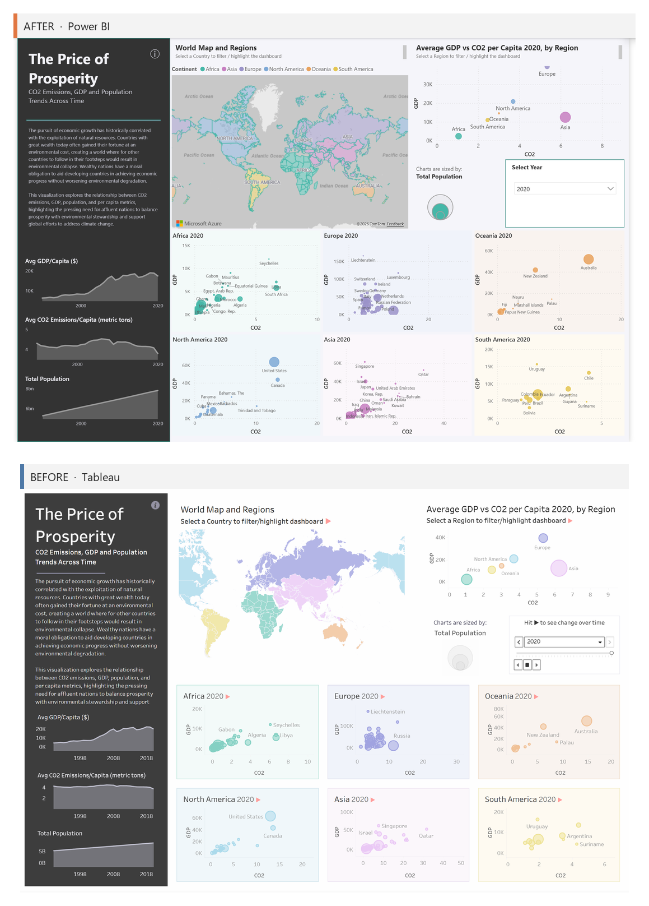

### Health Tracker

Personal health metrics dashboard. Nine KPI cards each pair a today value and week-over-week delta with a 7-day trend bar chart that highlights the latest day, at exact numeric fidelity across every metric (blood pressure, heart rate, BMI, calories burned/intake, steps, water, sleep, mood). The Tableau date-period switcher (Last Week / Month / Year) migrates to Power BI button navigation. The latest-day bar highlight surfaced a real off-by-one in the date-window calc that the fidelity validator caught and the model builder fixed.

**Source:** [original Tableau Public dashboard ↗](https://public.tableau.com/views/HealthTracker_17222296039800/HealthTrackerMetrics)

**Track Metrics**

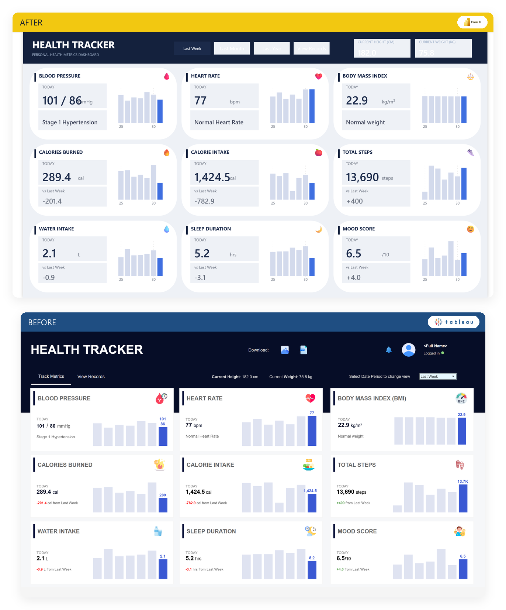

### NL Wind Energy Utilization

Netherlands wind-fleet performance dashboard (30 turbines, 2024 daily output). A star schema drives ranked turbine tables with data bars, an azureMap turbine-bubble layer over the Netherlands, a weekday-by-month output heatmap, TopN highest/lowest performer tables, and a wind-speed-vs-power scatter. Tableau's polar performance spiral is reproduced as DAX-computed X/Y measures. Numeric fidelity confirmed exact (total actual output 453,167.284 MWh, CO2 saved 169,031.370 t).

**Source:** [original Tableau Public dashboard ↗](https://public.tableau.com/views/WindEnergyUtilizationDashboard/WindEnergyOverview)

**Fleet Performance**

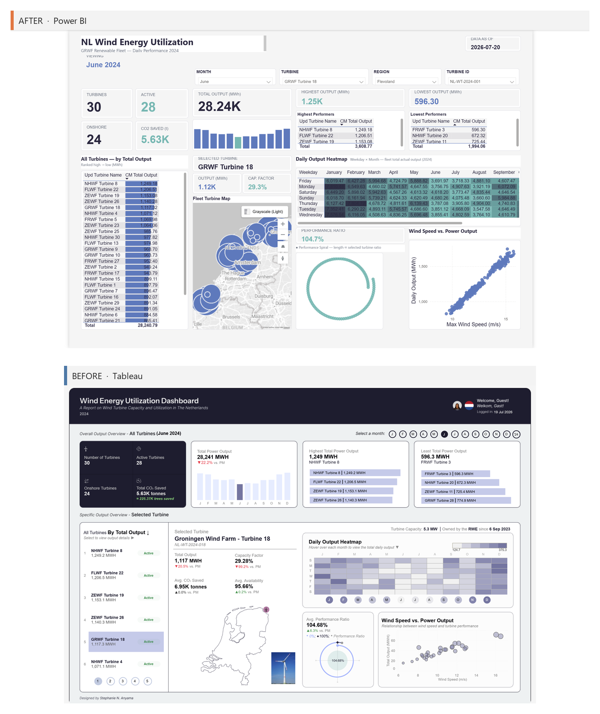

### Shipping KPIs

Logistics profitability & delay KPIs. GOOD/OK/BAD conditional coloring on scatter points and table rows; per-shipment profit-ratio FIXED LOD; faithful preservation of the source's Expected-minus-Actual delay quirk. Live Power BI Desktop render with data.

**Source:** [original Tableau Public dashboard ↗](https://public.tableau.com/views/ShippingIndustryExample_10_0/ProfitabilityKPI)

**Profitability KPI**

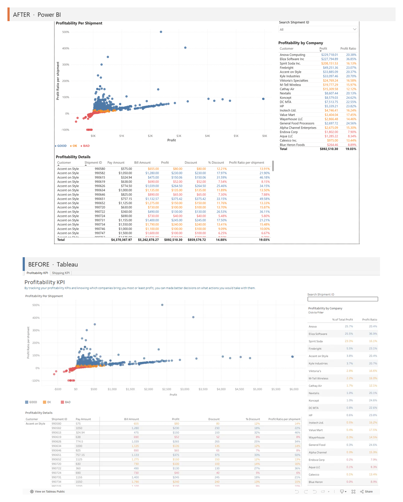

**Shipping KPI**

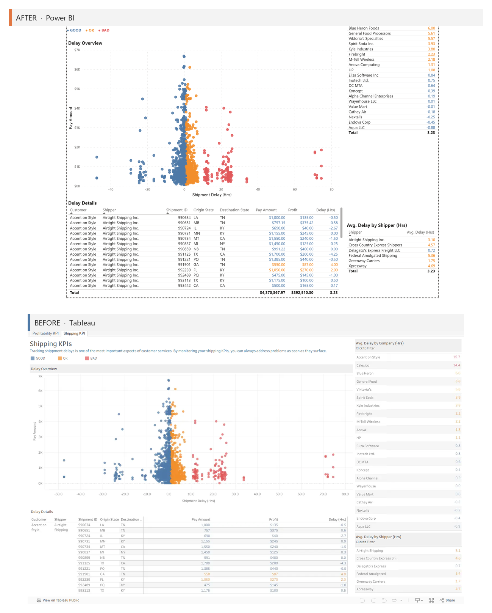

### Telecommunications Analytics

Radio-tower network dashboard. Tableau's MAKELINE link-lines between towers have no native Power BI equivalent, so they render as an azureMap point layer (a documented capability gap); the per-region stacked capacity bars and the link-detail table migrate faithfully.

**Source:** [original Tableau Public dashboard ↗](https://public.tableau.com/views/Telecommunications_2/Dashboard)

**Radio Towers Dashboard**

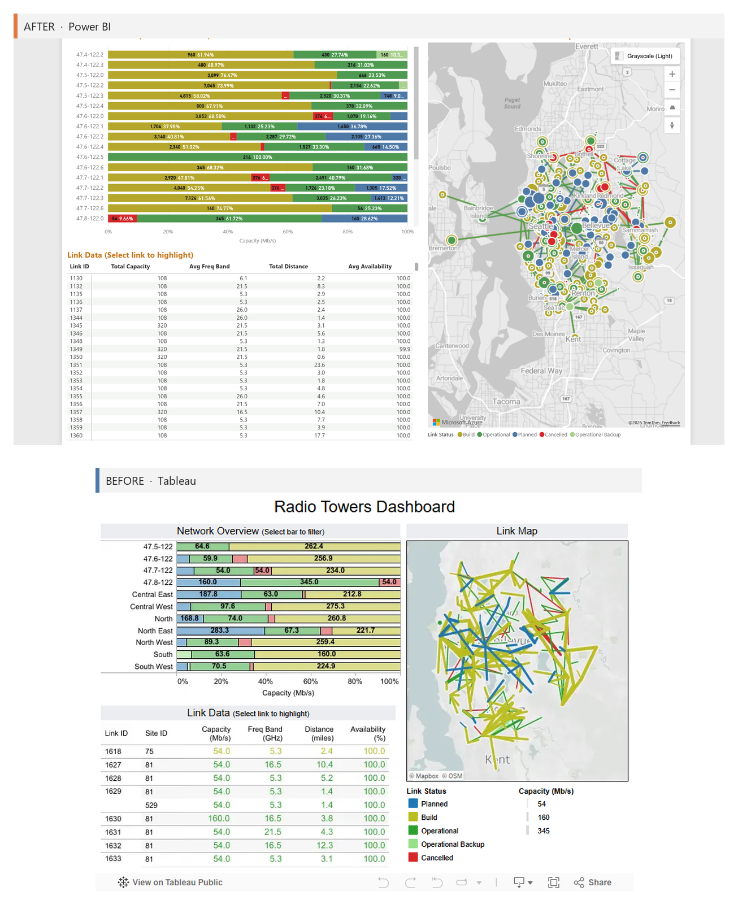

### Sales Commission Model

Interactive what-if commission calculator. Three What-If parameters (New Quota / Commission Rate / Base Salary) drive a dual-panel Sales-vs-Compensation bar chart with 4-bucket quota-attainment conditional coloring.

**Source:** [original Tableau Public dashboard ↗](https://public.tableau.com/views/SalesCommissionModel_10_0/CommissionModel)

**Commission Model**

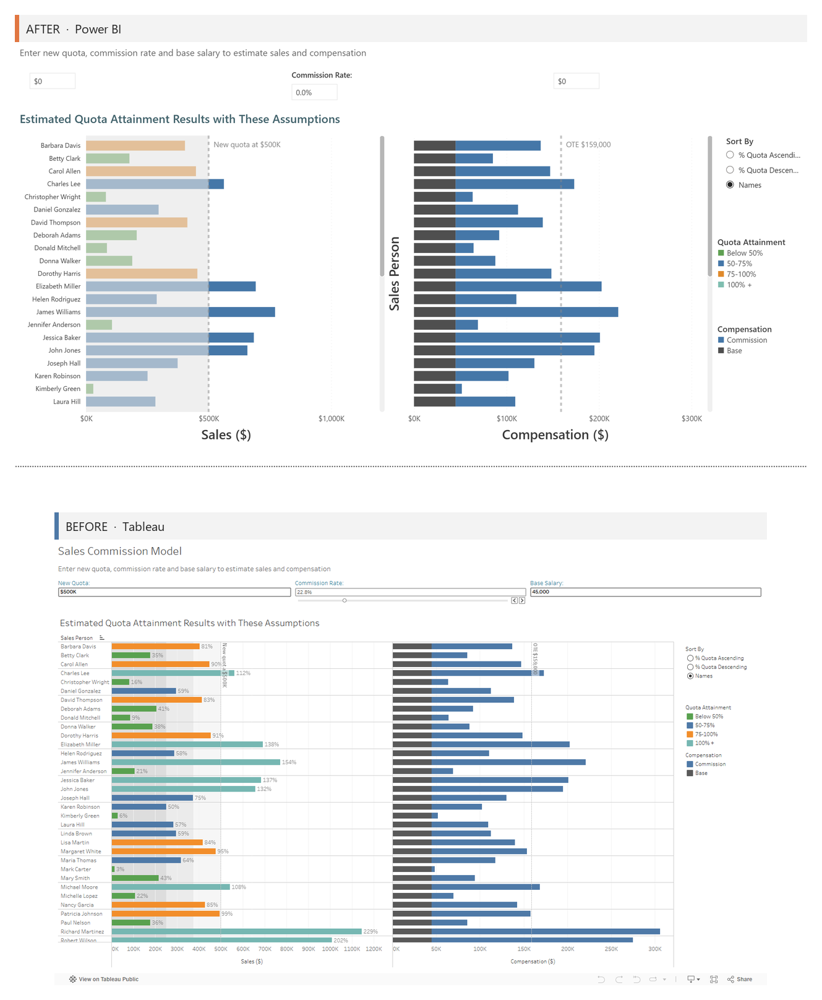

### Tale of 100 Entrepreneurs

Company revenue-growth analysis. Exercised the pipeline's first real Tableau table calculations (LOOKUP first/last, running INDEX) translated to verified DAX.

**Source:** [original Tableau Public dashboard ↗](https://public.tableau.com/views/Tale-of-100-Entrepreneurs_10_0_0/Taleof100Entrepreneurs)

**Tale of 100 Entrepreneurs**

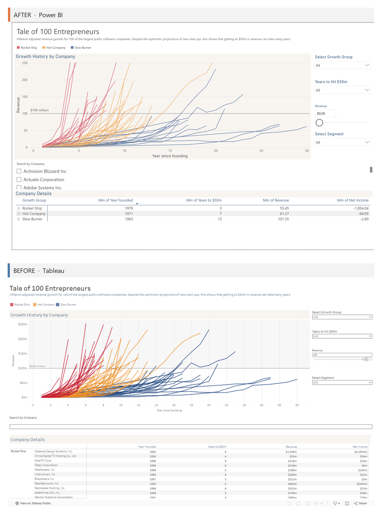

### Superstore Sales Performance

Three-dashboard analytics suite (Ryan Sleeper's Super Sample Superstore). Field Parameters for parameter-driven measure/dimension switching, current/prior-period comparison, azureMap region small-multiples, and region-comparison plots. (Basemap styling and KPI-card encodings are being re-rendered for higher fidelity.)

**Source:** [original Tableau Public dashboard ↗](https://public.tableau.com/views/VGContest_SuperSampleSuperstore_RyanSleeper/SuperAnnotations)

**Prescriptive**

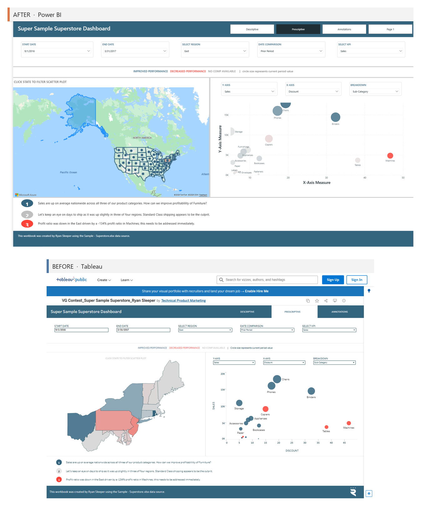

**Descriptive**

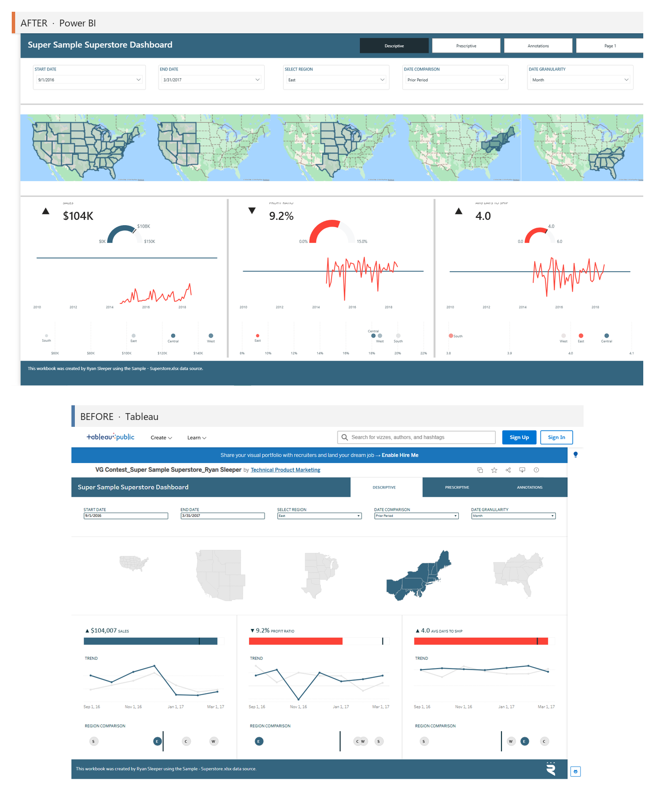

### Airline Alliance Activity

Largest workbook (91 worksheets, 4 pages, 108 measures). A CY/PY navigation app with an azureMap origin-destination map (the MAKELINE great-circle arc has no native PBI equivalent, so destination bubbles are used). Surfaced a systematic DAX bug: 58 comparison measures used the illegal compact filter `'Table'[Col]=[Measure]`, fixed by hoisting to VARs.

**Source:** [original Tableau Public dashboard ↗](https://public.tableau.com/views/AirlineAllianceActivityDashboard/AirlinesPage)

**Alliance Overview**

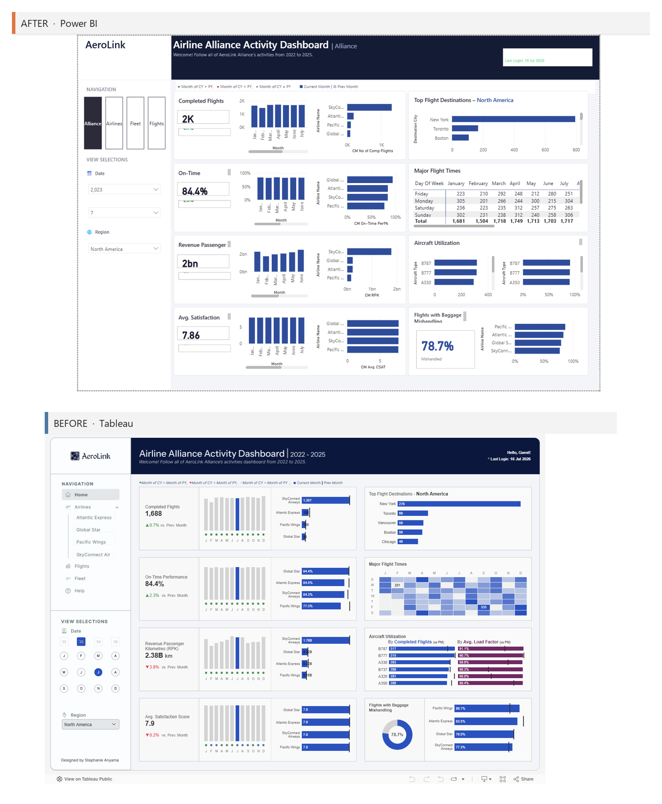

**Flights Map**

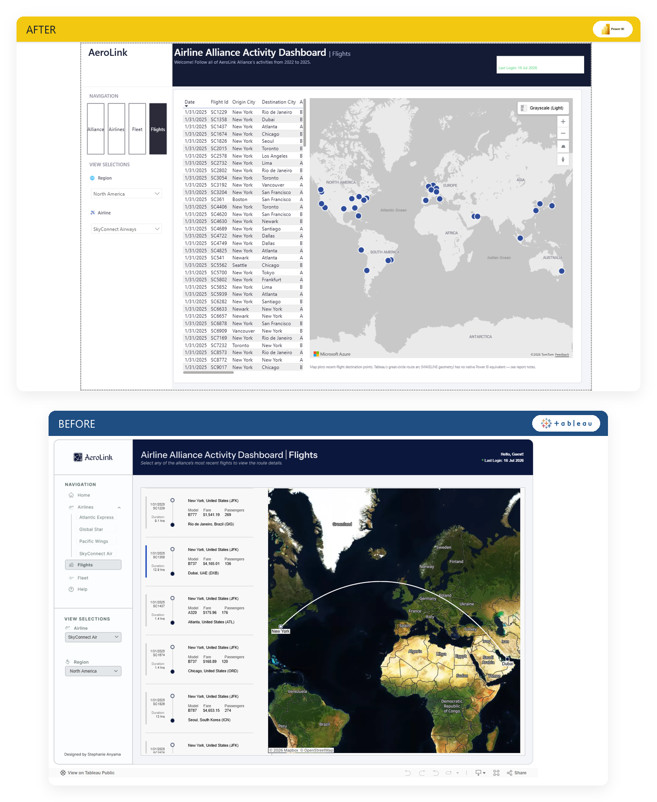
