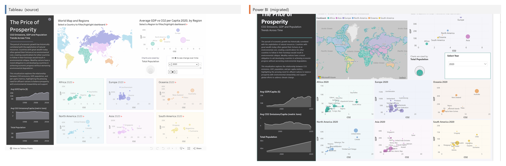
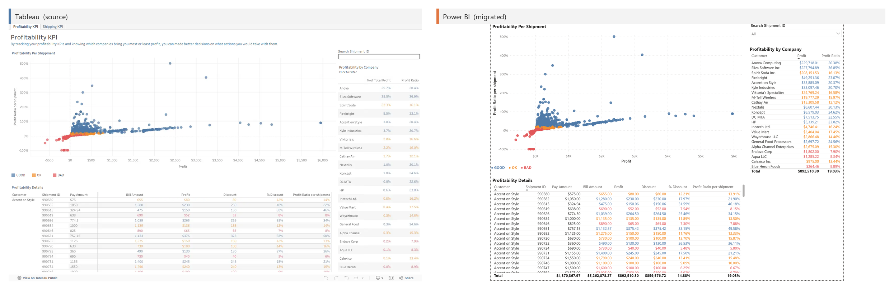
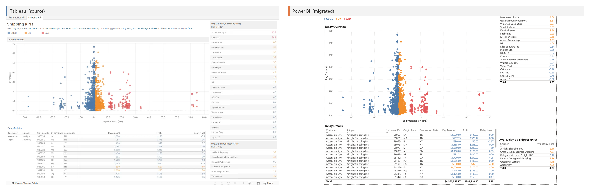
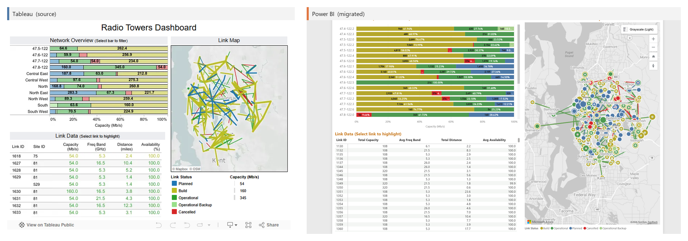
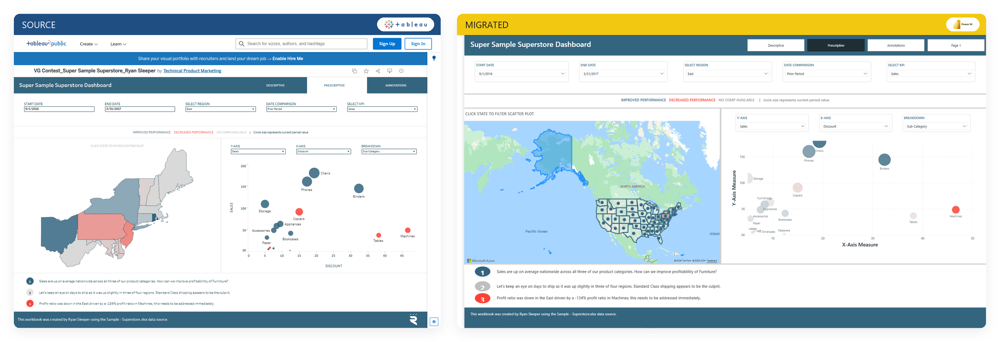
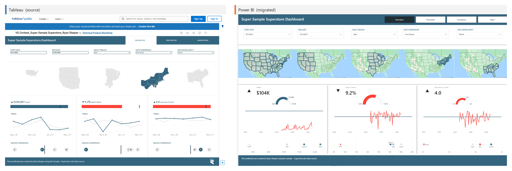
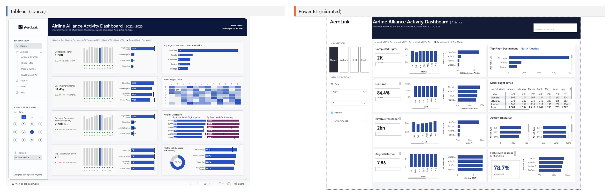
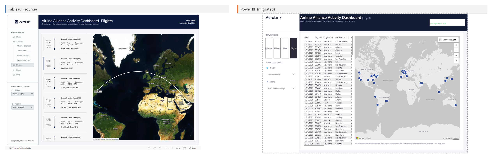

# Migration Showcase — Tableau → Power BI

Each row shows the original **Tableau** dashboard (left) next to the **Power BI** report our AI-assisted pipeline generated from it (right). Power BI screenshots are live Power BI Desktop renders of the generated PBIR report over the migrated semantic model.

> Generated by `scripts/make_showcase.py` from `docs/showcase/showcase.json`. Run with `--layout stacked` for tall, LinkedIn/mobile-friendly versions.

### The Price of Prosperity

Global CO2 emissions, GDP, and population trends. Produced end to end by the tableau-migrator orchestrator (a dogfood run) and signed off by the fidelity validator: a continent-colored world choropleth, a GDP-vs-CO2 region scatter, six per-continent small multiples, and sidebar trend sparklines. Numeric fidelity confirmed exact.

**Price of Prosperity**

### Shipping KPIs

Logistics profitability & delay KPIs. GOOD/OK/BAD conditional coloring on scatter points and table rows; per-shipment profit-ratio FIXED LOD; faithful preservation of the source's Expected-minus-Actual delay quirk. Live Power BI Desktop render with data.

**Profitability KPI**

**Shipping KPI**

### Telecommunications Analytics

Radio-tower network dashboard. Tableau's MAKELINE link-lines between towers have no native Power BI equivalent, so they render as an azureMap point layer (a documented capability gap); the per-region stacked capacity bars and the link-detail table migrate faithfully.

**Radio Towers Dashboard**

### Sales Commission Model

Interactive what-if commission calculator. Three What-If parameters (New Quota / Commission Rate / Base Salary) drive a dual-panel Sales-vs-Compensation bar chart with 4-bucket quota-attainment conditional coloring.

**Commission Model**

### Tale of 100 Entrepreneurs

Company revenue-growth analysis. Exercised the pipeline's first real Tableau table calculations (LOOKUP first/last, running INDEX) translated to verified DAX.

**Tale of 100 Entrepreneurs**

### Superstore Sales Performance

Three-dashboard analytics suite (Ryan Sleeper's Super Sample Superstore). Field Parameters for parameter-driven measure/dimension switching, current/prior-period comparison, azureMap region small-multiples, and region-comparison plots. (Basemap styling and KPI-card encodings are being re-rendered for higher fidelity.)

**Prescriptive**

**Descriptive**

### Airline Alliance Activity

Largest workbook (91 worksheets, 4 pages, 108 measures). A CY/PY navigation app with an azureMap origin-destination map (the MAKELINE great-circle arc has no native PBI equivalent, so destination bubbles are used). Surfaced a systematic DAX bug: 58 comparison measures used the illegal compact filter `'Table'[Col]=[Measure]`, fixed by hoisting to VARs.

**Alliance Overview**

**Flights Map**

